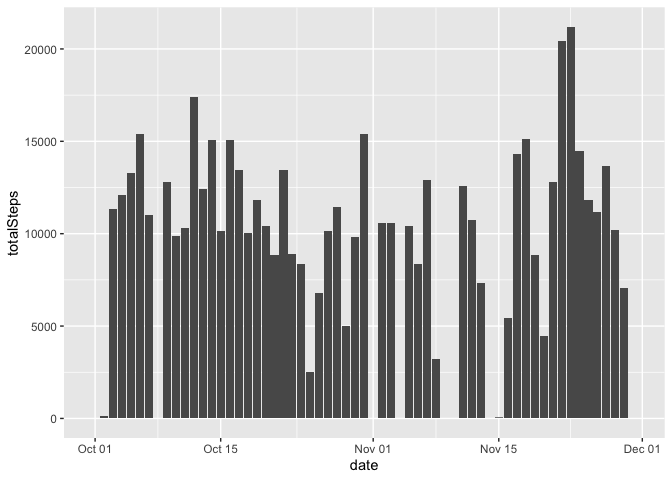
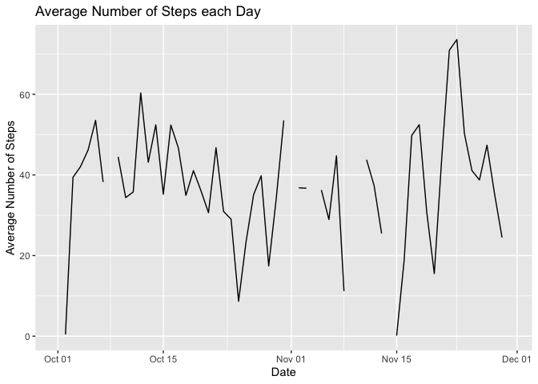
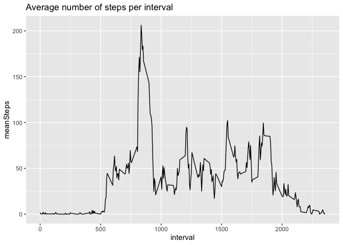
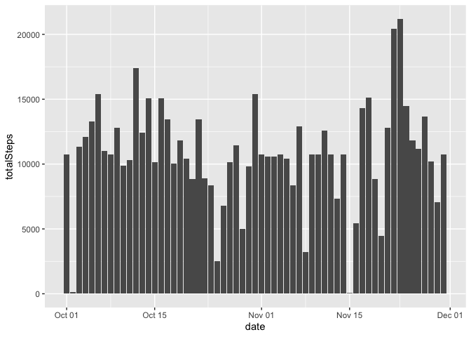
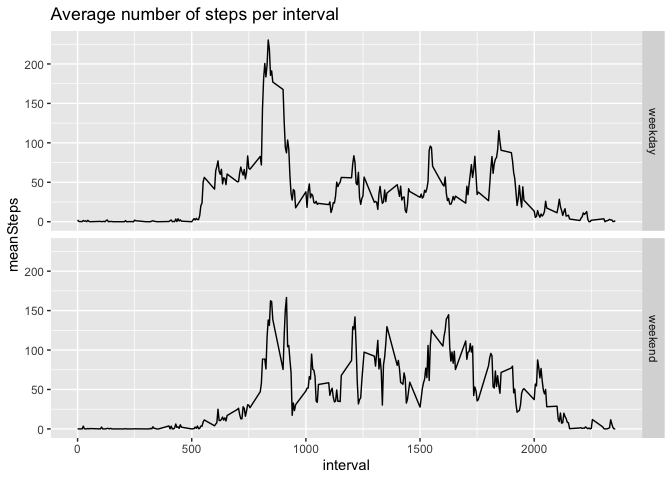

## Loading and preprocessing the data

Unzip, read, convert dates

```r
library(tidyverse)

unzip("activity.zip")
activity <- read.csv("activity.csv", na.strings = "NA") %>% 
    as_tibble %>%
    mutate(date=as.Date(date)) %>%
    mutate(time=as.POSIXlt(date) + 
               as.difftime(as.integer(interval/100), unit="hours") + 
               as.difftime(interval %% 100, unit="mins"))
```


## What is mean total number of steps taken per day?

```r
totalStepsPerDay <- activity %>%
    group_by(date) %>%
    summarise(totalSteps = sum(steps, na.rm = TRUE))
ggplot(totalStepsPerDay, aes(x=date, y=totalSteps)) + geom_histogram(stat="identity") 
```

<!-- -->

```r
meanTotalSteps <- as.integer(mean(totalStepsPerDay$totalSteps, na.rm = TRUE))
medianTotalSteps <- as.integer(median(totalStepsPerDay$totalSteps, na.rm = TRUE))
```

The mean total number of steps taken per day: 9354.  
The median total number of steps taken per day: 10395.

## What is the average daily activity pattern?


```r
meanStepsPerDay <- activity %>%
    group_by(date) %>%
    summarise(meanSteps = mean(steps, na.rm = TRUE))
ggplot(meanStepsPerDay, aes(x=date, y=meanSteps)) + 
    geom_line(na.rm = TRUE) + 
    labs(x="Date", y="Average Number of Steps", title="Average Number of Steps each Day")
```

<!-- -->


```r
library(knitr)
meanStepsPerInterval <- activity %>%
    group_by(interval) %>%
    summarise(meanSteps = mean(steps, na.rm = TRUE))
ggplot(meanStepsPerInterval, aes(x=interval, y=meanSteps)) + 
    geom_line(na.rm = TRUE) + 
    labs(title="Average number of steps per interval")
```

<!-- -->


```r
maxIndex <- which(meanStepsPerInterval$meanSteps == max(meanStepsPerInterval$meanSteps, na.rm = TRUE))
maxInterval <- meanStepsPerInterval$interval[maxIndex]
```

The interval with max steps, on average over all days: 835.


## Imputing missing values

For every missing value, we take the mean of the interval over all days.  


```r
totalNA <- sum(is.na(activity$steps))
imputedActivity <- activity %>%
    inner_join(meanStepsPerInterval, by = "interval") %>%
    mutate(steps=ifelse(is.na(steps), meanSteps, steps))
totalImputedNA <- sum(is.na(imputedActivity$steps))
```
Number of missing values imputed: 2304.  


```r
totalStepsPerDayImputed <- imputedActivity %>%
    group_by(date) %>%
    summarise(totalSteps = sum(steps))
ggplot(totalStepsPerDayImputed, aes(x=date, y=totalSteps)) + geom_histogram(stat="identity") 
```

<!-- -->

```r
meanTotalStepsImputed <- as.integer(mean(totalStepsPerDayImputed$totalSteps))
medianTotalStepsImputed <- as.integer(median(totalStepsPerDayImputed$totalSteps))
```

The mean total number of steps taken per day: 10766.  
The median total number of steps taken per day: 10766.

Imputing effect:

 * histogram has data for more days

 * mean and median increased 

## Are there differences in activity patterns between weekdays and weekends?


```r
imputedActivity <- imputedActivity %>%
    mutate(day = as.factor(ifelse(weekdays(date, abbr = TRUE) %in% c("Sat", "Sun"), "weekend", "weekday")))
meanStepsPerIntervalImputed <- imputedActivity %>%
    group_by(interval, day) %>%
    summarise(meanSteps = mean(steps, na.rm = TRUE))
ggplot(meanStepsPerIntervalImputed, aes(x=interval, y=meanSteps)) + 
    geom_line(na.rm = TRUE) + 
    facet_grid(rows=vars(day)) +
    labs(title="Average number of steps per interval")
```

<!-- -->
